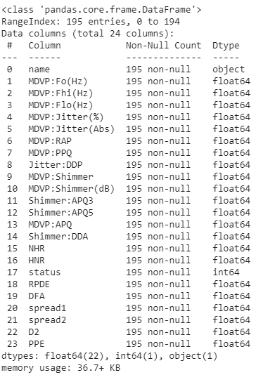
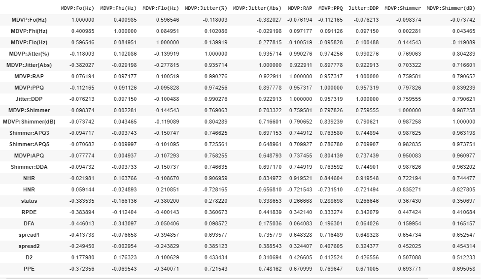
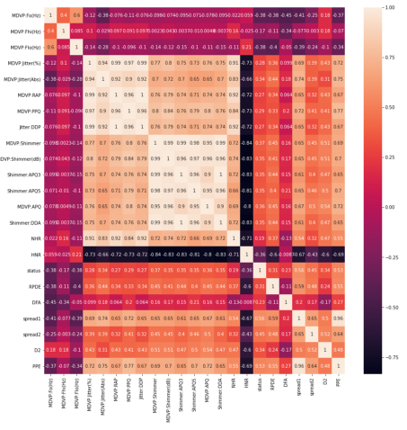
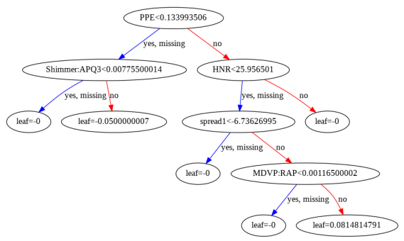
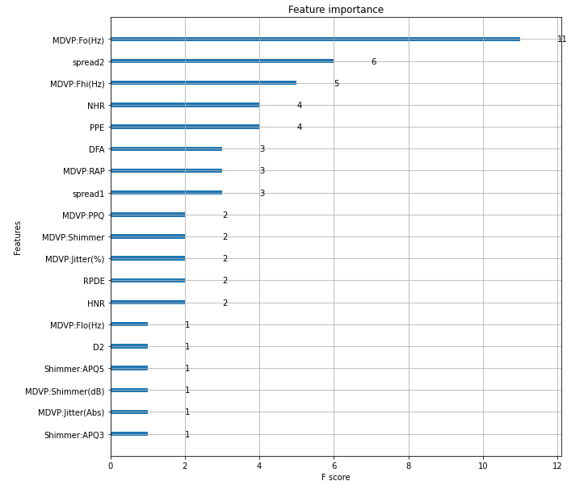

# XGBoost Predicting Parkinson Diseases

## Introduction 


Neurodegenerative diseases are a heterogeneous group of disorders that are characterized
by the progressive degeneration of the structure and function of the nervous system. They
are incurable and debilitating conditions that cause problems with mental functioning
also called dementias.  

Neurodegenerative diseases affect millions of people worldwide. Alzheimer’s disease and
Parkinson’s disease are the most common neurodegenerative diseases. In 2016, an
estimated 5.4 million Americans were living with Alzheimer’s disease. An estimated
930,000 people in the United States could be living with Parkinson’s disease by 2020.

The goal of this project is to build a model to accurately predict the presence of a
neurodegenerative disease in an individual as early detection of a neurodegenerative
disease could be useful for the identification of people who can participate in trials of
neuroprotective agents, or ultimately to try and halt disease progression once effective
disease-modifying interventions have been identified.

## Dataset

The dataset was created by Max Little of the University of Oxford, in 
collaboration with the National Centre for Voice and Speech, Denver, 
Colorado, who recorded the speech signals. The original study published the 
feature extraction methods for general voice disorders.

[UCI ML Parkinson’s dataset](https://archive.ics.uci.edu/ml/machine-learning-databases/parkinsons/)

The metadata from this dataset is a file, so we need to open it in a programming way.

```
# Download the metadata using wget command
!wget https://archive.ics.uci.edu/ml/machine-learning-databases/parkinsons/parkinsons.names

# Read the dataset metadata
with open('/content/parkinsons.names') as txt:
    for t in txt:
        print(t)
```

From existing metadata, we get some important information, such as:
* Title: Parkinsons Disease Data Set
* Abstract: Oxford Parkinson's Disease Detection Dataset
* Data Set Characteristics: Multivariate
* Number of Instances: 197
* Number of Attributes: 23  

### Dataset Information:

This dataset is composed of a range of biomedical voice measurements from 31 people, 23 with Parkinson's disease (PD). Each column in the table is a particular voice measure, and each row corresponds one of 195 voice recording from these individuals ("name" column). The main aim of the data is to discriminate healthy people from those with PD, according to "status" column which is set to 0 for healthy and 1 for PD.  


### Attribute Information:

Matrix column entries (attributes):

* name - ASCII subject name and recording number
* MDVP:Fo(Hz) - Average vocal fundamental frequency
* MDVP:Fhi(Hz) - Maximum vocal fundamental frequency
* MDVP:Flo(Hz) - Minimum vocal fundamental frequency
* MDVP:Jitter(%),MDVP:Jitter(Abs),MDVP:RAP,MDVP:PPQ,Jitter:DDP - Several 
* measures of variation in fundamental frequency
* MDVP:Shimmer,MDVP:Shimmer(dB),Shimmer:APQ3,Shimmer:APQ5,MDVP:APQ,Shimmer:DDA - Several measures of variation in amplitude
* NHR,HNR - Two measures of ratio of noise to tonal components in the voice
* status - Health status of the subject (one) - Parkinson's, (zero) - healthy
* RPDE,D2 - Two nonlinear dynamical complexity measures
* DFA - Signal fractal scaling exponent
* spread1,spread2,PPE - Three nonlinear measures of fundamental frequency variation 

## Exploratory Data Analysis

```
# Download the dataset using wget command
!wget https://archive.ics.uci.edu/ml/machine-learning-databases/parkinsons/parkinsons.data

# Import the dataframe using Pandas
df = pd.read_csv('parkinsons.data')
df
```

Before we step further, we need to explore our dataset first. This EDA's steps include:

1.   Using `.info()` method to examine each column data type and possible missing data

```
# Examine the data type for each columns and possible missing data
df.info()
```



2.   Using `.describe()` method to see data summary statictic, such as min, median, max, and so on.

```	
# See the statistic summary 
df.describe()
```


3.   Using `.corr()` to see if there is a correlation between a pair of feature.

```
# See correlation for each feature
df.corr()
```



4.   Then we draw the heatmap to easily examine the result from step 3.

```
# Plot heatmap
fig, ax = plt.subplots(figsize=(15,15))
ax = sns.heatmap(df.corr(), annot=True);
```



5.   Plot status column using pie chart.

```
# Plot using pie chart
df.status.value_counts().plot.pie()
```


## Data Preparation
Since the status column is located in the middle of dataset, we need to move it to the far right, so we can easily slice the dataset.

```
# Move status column to the far right 
cols = list(df)
cols.insert(24, cols.pop(cols.index('status')))
```

## Data Modelling
We using XGBoost to model our Dataset because is well known to provide better solustions than other machine learning algorithm.

```
X,y = df.iloc[:,1:-1],df.iloc[:,-1]
data_dmatrix = xgb.DMatrix(data=X,label=y)
X_train, X_test, y_train, y_test = train_test_split(X, y, test_size=0.2, random_state=43)
xg_reg = xgb.XGBRegressor(objective ='binary:hinge', colsample_bytree = 0.3, learning_rate = 0.1,
                max_depth = 5, alpha = 10, n_estimators = 10)
xg_reg.fit(X_train,y_train)
preds = xg_reg.predict(X_test)
rmse = np.sqrt(mean_squared_error(y_test, preds))
print("RMSE: %f" % (rmse))
```

We got the RMSE score: 0.226455.

## Tree Visualization and Important Features
XGBoost has `plot_tree()` funtion that allow us to plot the fully boosted tree from our model.

```
xg_reg = xgb.train(params=params, dtrain=data_dmatrix, num_boost_round=10)
xgb.plot_tree(xg_reg,num_trees=0)
plt.rcParams['figure.figsize'] = [50, 50]
plt.show()
```



It can also act as important feature selector.
```
xgb.plot_importance(xg_reg)
plt.rcParams['figure.figsize'] = [10, 10]
plt.show()
```



The most important feature from this dataset MDVP:Fo(Hz) feature.

## K-Fold Cross Validation
We need to check our model accuracy. We have usedd K-fold cross validation and get accuracy 80.97%.

```
# k-fold cross validation evaluation of xgboost model
model = xgb.XGBClassifier()
kfold = KFold(n_splits=10, random_state=43)
results = cross_val_score(model, X, y, cv=kfold)
print("Accuracy: %.2f%% (%.2f%%)" % (results.mean()*100, results.std()*100))
```

## Reference
'Exploiting Nonlinear Recurrence and Fractal Scaling Properties for Voice Disorder Detection', Little MA, McSharry PE, Roberts SJ, Costello DAE, Moroz IM. BioMedical Engineering OnLine 2007, 6:23 (26 June 2007)  
[Display full dataframe](https://stackoverflow.com/questions/11707586/how-do-i-expand-the-output-display-to-see-more-columns-of-a-pandas-dataframe)  
[Move column in dataframe](https://stackoverflow.com/questions/25122099/move-column-by-name-to-front-of-table-in-pandas)  
[Xgboost in Python](https://www.datacamp.com/community/tutorials/xgboost-in-python)  

---

For the blog, you can refer [here](https://www.datainsightonline.com/post/xgboost_predicting-parkinson-diseases)